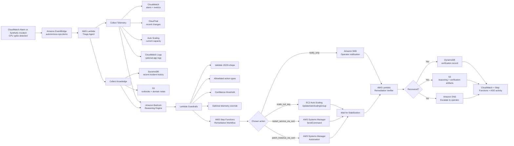

# AWS Pipeline Flow

This page shows the end-to-end event flow for the deployed autonomous-ops demo, from incident detection through remediation and verification.

## Primary demo path

The real demo path we pre-staged in AWS is:

`CloudWatch CPU alarm -> EventBridge -> Lambda triage -> Bedrock reasoning -> Step Functions -> Auto Scaling -> verifier Lambda -> DynamoDB/S3 writeback`

## End-to-end flowchart



## What happens at each stage

1. CloudWatch detects the issue.
   In the CPU spike scenario, the alarm `orders-api-asg-cpu-high` moves to `ALARM`.

2. EventBridge becomes the handoff point.
   The incident enters the custom bus `autonomous-ops-demo`, which routes the event to the triage Lambda.

3. The triage Lambda builds the case file.
   It gathers current alarm state, recent CPU metrics, recent CloudTrail changes, current Auto Scaling Group state, recent incidents from DynamoDB, and domain knowledge from S3.

4. Bedrock reasons over the incident.
   Bedrock receives a structured prompt and returns a candidate JSON action plan with fields like `summary`, `diagnosis`, `confidence`, and `action`.

5. Lambda applies guardrails before anything executes.
   The function validates the returned JSON, checks the action against an allowlist, enforces a confidence threshold, and can apply a bounded override for sustained CPU saturation.

6. Step Functions executes the approved path.
   The workflow branches based on `decision.action.type` and calls the specific AWS API for that action.

7. The verifier Lambda checks whether the remediation worked.
   For the scale-out path, it re-reads CPU metrics and recent scaling activity to determine whether recovery was achieved.

8. The system writes operational memory back to the knowledge base.
   Triage data is stored in DynamoDB and S3, and verification results are also written back so future incidents have more context.

## What Bedrock actually decides

Bedrock does not directly call infrastructure APIs.

It returns a candidate decision object, and the Lambda turns that into an executable workflow input only after validation. In the successful pre-staged demo run, the resulting decision passed into Step Functions was effectively:

```json
{
  "summary": "Sustained CPU spike detected on the application tier.",
  "diagnosis": "The Auto Scaling group is saturated and needs more capacity.",
  "confidence": 0.98,
  "action": {
    "type": "scale_out_asg",
    "reason": "Increase capacity to reduce CPU saturation.",
    "parameters": {
      "autoScalingGroupName": "orders-api-asg",
      "desiredCapacity": 3,
      "recoveryThreshold": 65
    },
    "requiresApproval": false
  }
}
```

The important trust boundary is:

`Bedrock recommends -> Lambda validates -> Step Functions executes`

## AWS services used in the pipeline

| Stage | AWS service | What it contributes |
| --- | --- | --- |
| Detection | CloudWatch | Alarm state and CPU metrics |
| Event handoff | EventBridge | Routes incident events into the workflow |
| Triage | Lambda | Enriches the event and prepares the decision request |
| Reasoning | Bedrock | Produces the candidate diagnosis and action |
| Memory | DynamoDB | Stores recent incidents and verification summaries |
| Knowledge artifacts | S3 | Stores runbooks, reasoning artifacts, and verification artifacts |
| Orchestration | Step Functions | Executes the chosen remediation branch |
| Remediation | EC2 Auto Scaling or SSM | Performs the actual corrective action |
| Verification | Lambda | Checks whether service health recovered |
| Notification | SNS | Escalates when recovery is not verified |

## Best screens to pair with this flowchart

If you are presenting this pipeline live, the cleanest screen sequence is:

1. Step Functions execution
2. Auto Scaling Group details
3. Auto Scaling activity
4. EC2 instances
5. CloudWatch alarm
6. DynamoDB incident item
7. S3 reasoning and verification artifacts
