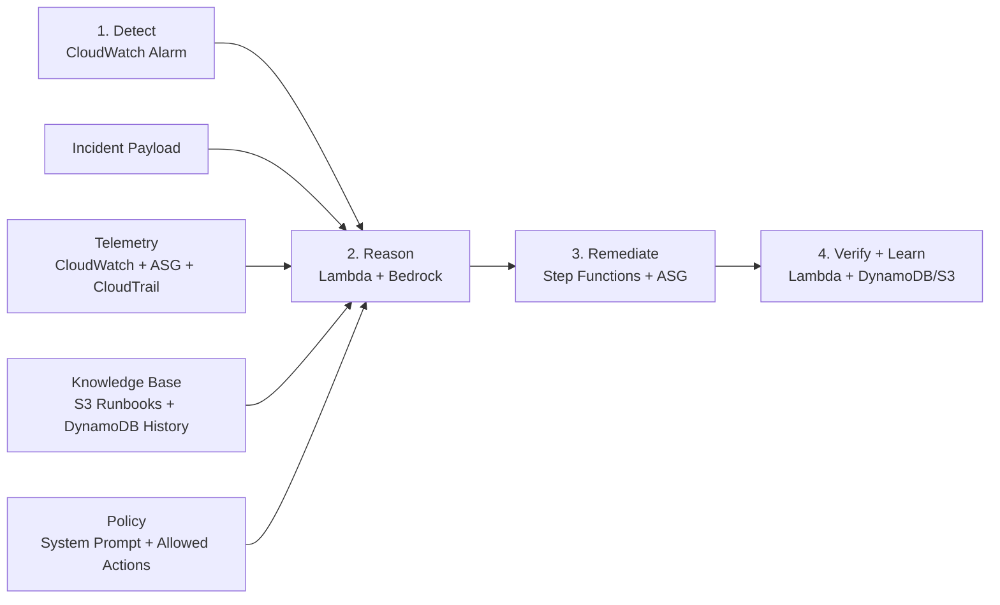

# Judge Slide Flow

This page is the simplified, single-slide version of the AWS pipeline for a short judge-facing demo.

## Slide title

`Agentic AI for Autonomous Cloud Operations on AWS`

## One-slide version

## Large-label version for the slide body

Use these exact labels on the slide:

- `Detect`
- `Reason`
- `Remediate`
- `Verify + Learn`

Use these small callouts feeding `Reason`:

- `Incident Payload`
- `Telemetry`
- `Knowledge Base`
- `Policy`

## One-line explanation for Bedrock

`Bedrock is the reasoning engine: it reviews incident context, telemetry, prior knowledge, and the allowed action policy, then returns a bounded remediation recommendation for the workflow to execute.`

## One-line trust boundary

`Bedrock recommends. Lambda validates. Step Functions executes.`

## One-line business value

`The system acts like a virtual cloud engineer: detect the issue, choose the safest fix, apply it, and verify recovery.`

## What to point at while presenting

Pair the slide with these AWS screens:

1. Step Functions execution
2. Auto Scaling Group details showing `desired=3`
3. EC2 instances showing three `t3.micro` instances
4. CloudWatch alarm back to `OK`

## 20-second talk track

`This is the full loop. CloudWatch detects the issue, Lambda builds the case using telemetry, prior knowledge, and policy constraints, Bedrock recommends the best allowed fix, Step Functions executes it, and the system verifies recovery and stores the result for future incidents.`

## If a judge asks what Bedrock actually does

`Bedrock does not call AWS APIs directly. Lambda sends it the incident payload, recent telemetry, prior incident history, runbook knowledge, and the allowed action catalog. Bedrock returns a structured recommendation like scale this Auto Scaling Group to 3, and the guardrails and execution stay in Lambda and Step Functions.`
